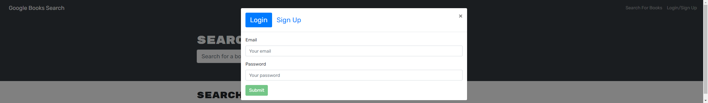

# Book Search

## Description
This is a handy google book search engine useful for any book worm to search and save books they're interested in or just to see whats available to them. To save books you'll need to create a sign in and you will be able to view and update your list of books.

## Table of Contents

* [Usage](#usage)
* [Contributing](#contributing)

## Usage
Deployed and functional application on Heroku @: [https://book-search-ja.herokuapp.com/](https://book-search-ja.herokuapp.com/).

## Contributing
Starter code supplied by [GitHub](https://github.com/Xandromus)/Xandromus/

Made with ❤️ by: [GitHub](https://github.com/jasmineakbari)/jasmineakbari/

If you would like to contribute to this work please feel free to submit any push/pull request, create issues or reach out to me at my email: jasmineakbari@yahoo.com.